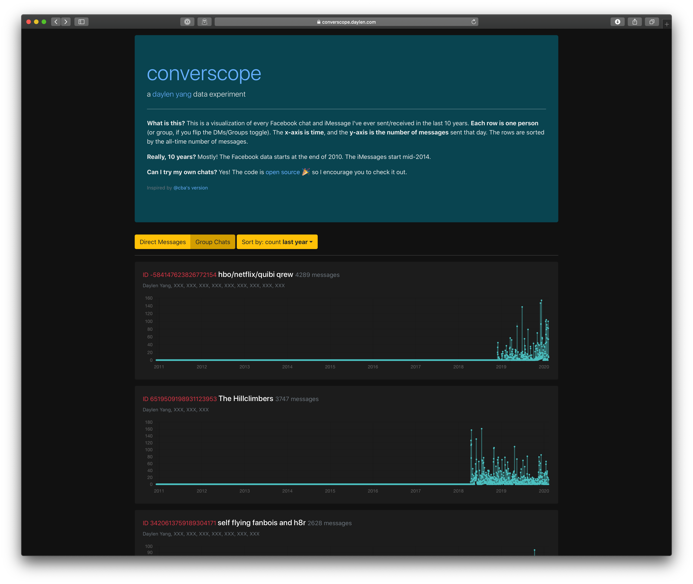

# Converscope

Analyze your Facebook and iMessage conversations.



## Instructions
You can get the same charts for your own data! Here's how:

### Preparing the data
1. Facebook: Download your Facebook messages at https://www.facebook.com/dyi/. Select the JSON format and deselect everything except Messages.
2. iMessage: (This step requires having a Mac) Your iMessage data is located in `~/Library/Messages/chat.db`. Copy that to the `./data/` folder. For optimal results, make sure "Messages in iCloud" is enabled so old messages from your iPhone sync over. You also need a CSV of your contacts. If you use the Contacts app, you can copy and paste your contacts into Numbers and save that as a CSV.
3. Modify paths in `constants.py` and then run `python3 data_merge.py` to get a single `inbox.pb` file. Conversations are automatically merged between your Facebook and iMessage data.

### Running the server
1. Configure your `STRIP_PII` preference in `constants.py`
2. Build the React front-end: `cd converscope-react && npm install && npm run build`.
3. Run the metrics server: `export FLASK_APP=server.py && flask run`  Then visit http://localhost:5000

## License

```
MIT License

Copyright (c) 2019 Daylen Yang

Permission is hereby granted, free of charge, to any person obtaining a copy
of this software and associated documentation files (the "Software"), to deal
in the Software without restriction, including without limitation the rights
to use, copy, modify, merge, publish, distribute, sublicense, and/or sell
copies of the Software, and to permit persons to whom the Software is
furnished to do so, subject to the following conditions:

The above copyright notice and this permission notice shall be included in all
copies or substantial portions of the Software.

THE SOFTWARE IS PROVIDED "AS IS", WITHOUT WARRANTY OF ANY KIND, EXPRESS OR
IMPLIED, INCLUDING BUT NOT LIMITED TO THE WARRANTIES OF MERCHANTABILITY,
FITNESS FOR A PARTICULAR PURPOSE AND NONINFRINGEMENT. IN NO EVENT SHALL THE
AUTHORS OR COPYRIGHT HOLDERS BE LIABLE FOR ANY CLAIM, DAMAGES OR OTHER
LIABILITY, WHETHER IN AN ACTION OF CONTRACT, TORT OR OTHERWISE, ARISING FROM,
OUT OF OR IN CONNECTION WITH THE SOFTWARE OR THE USE OR OTHER DEALINGS IN THE
SOFTWARE.
```